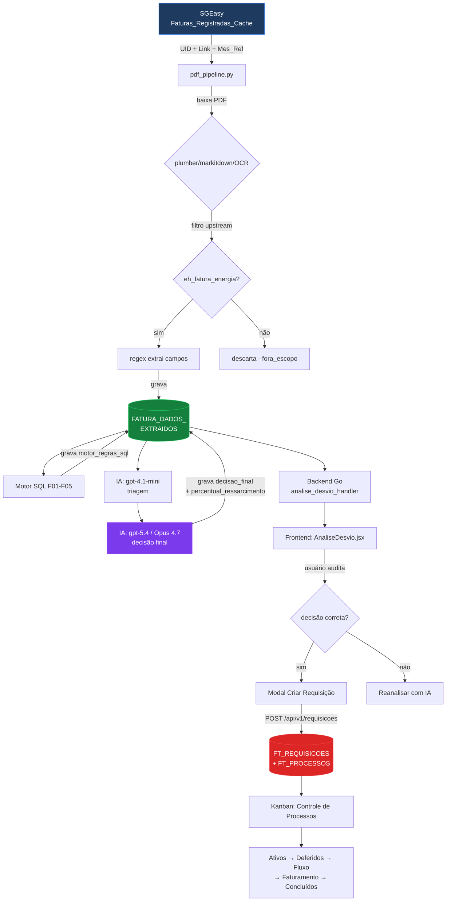

# Fluxo da Análise de Desvio — SURE

**Documento técnico** descrevendo, ponta a ponta, como uma fatura de energia entra no sistema, é analisada, classificada e vira processo de ressarcimento.

> Atualizado em **2026-05-08** após sincronização SGEasy ↔ FATURA_DADOS_EXTRAIDOS via UID e prompt v3 da IA.

---

## Visão geral

```
┌──────────────────┐   ┌───────────────┐   ┌─────────────────┐   ┌────────────┐   ┌──────────────┐
│  SGEasy          │──▶│  pdf_pipeline │──▶│  Motor SQL      │──▶│  IA        │──▶│  Frontend    │
│  (origem)        │   │  (OCR/regex)  │   │  (F01–F05)      │   │  (gpt/Opus)│   │  (AnaliseDvo)│
└──────────────────┘   └───────────────┘   └─────────────────┘   └────────────┘   └──────────────┘
       │                       │                    │                  │                  │
       │                       │                    │                  │                  ▼
       ▼                       ▼                    ▼                  ▼          ┌──────────────┐
  Faturas_Registradas    FATURA_DADOS         fichas_apontadas    fichas_apontadas │  FT_REQUISICOES │
  _Cache (PDF link,      _EXTRAIDOS           .motor_regras_sql   .decisao_final   │  + FT_PROCESSOS │
  UC, Mes_Ref, etc.)     (campos canônicos)   (flags)             (CONFIRMADO/etc) └──────────────┘
```

Total atual no banco (08/05/2026): **22.683 faturas** com `uid`, **22.645 com correspondência no SGEasy**, **371 já analisadas pela IA na empresa 4** (dataset de referência usado para auditoria).

---

## ETAPA 0 — Origem: SGEasy (`sgeeasy_clientes_novo.Faturas_Registradas_Cache`)

Banco **externo** mantido pelo time SGEasy. Coleta os PDFs das distribuidoras de energia automaticamente e expõe via tabela única.

### Campos relevantes (lidos pelo nosso pipeline)

| Coluna SGEasy | Tipo | O que é |
|---|---|---|
| `UID` | varchar | Identificador único `{cod_empresa}{contrato}{seq}{YYYYMMDD}` (ex.: `43195720210901`) |
| `UC` | varchar | Unidade Consumidora (código da distribuidora) |
| `Cod_Empresa` | int | Cliente AMEnergia (4 = VIA S.A., etc.) |
| `Mes_Ref` | date | Mês de **competência** da distribuidora (= data emissão) |
| `Link` | varchar | URL do PDF da fatura no SGEasy |
| `Concessionaria` | varchar | Distribuidora (ENEL SP, LIGHT, NEOENERGIA BA…) |
| `RAZAO_SOCIAL` | varchar | Cliente final (CNPJ titular da UC) |
| `Tp_Tensao`, `KWH_*`, `Leitura_*` | vários | Dados brutos pré-OCR (usados pelo motor SQL F01) |

**Observação crítica:** o `Mes_Ref` aqui é a **data de emissão da fatura** (= mês em que a distribuidora cobrou), não o **mês de medição**. Ex.: fatura cuja leitura foi 11/08–13/09/2021 tem `Mes_Ref = 2021-10-01` (emitida em outubro). Quem manda no nosso banco é esse formato — desde 08/05/2026, o `mes_referencia` em `FATURA_DADOS_EXTRAIDOS` foi sincronizado para bater com `Mes_Ref` (formato `MM-YYYY`).

### Acesso

- User: `alisson_rodrigues` (com SELECT em `sgeeasy_clientes_novo`)
- Host: `179.127.27.122:3306`
- **Não modificar nada** lá — é fonte de verdade externa, leitura apenas.

---

## ETAPA 1 — Extração: `ia/pdf_pipeline.py`

Pipeline Python que baixa o PDF, extrai os campos e grava em nosso banco.

### Como roda

```bash
python pipeline.py --empresa 4               # processa empresa específica
python pipeline.py --empresa 4 --ids 42574   # ids específicos
python pipeline.py --empresa 4 --limite 100  # primeiros 100 não-processados
```

### Sub-etapas

```
PDF (sgevia.com.br/download/.../BT/)
     │
     │  baixa via requests
     ▼
┌────────────────────────────────────┐
│ 3 motores de extração em cascata   │
│  1) plumber  (texto estruturado)   │ ← preferido
│  2) markitdown (texto enriquecido) │ ← fallback 1
│  3) PaddleOCR (visual)             │ ← fallback 2
└────────────────────────────────────┘
     │
     │  texto bruto unificado
     ▼
┌────────────────────────────────────────┐
│ Filtro upstream: eh_fatura_energia()   │
│  Descarta SANASA, COPASA, COMGÁS, etc. │
│  Mantém apenas faturas de energia.     │
└────────────────────────────────────────┘
     │
     │  só faturas válidas
     ▼
┌────────────────────────────────────────┐
│ Regex extrai campos canônicos:         │
│  - mes_ref, dt_leit_ant, dt_leit_atu   │
│  - leituras kWh + constantes           │
│  - valor_total_fatura, tarifas         │
│  - histórico_consumo_12_meses          │
│  - numero_fatura, numero_medidor       │
│  - flags: indicador_leitura_real, etc. │
└────────────────────────────────────────┘
     │
     │  dict de campos
     ▼
┌─────────────────────────────────────────────┐
│ Grava em db_ressarcimento.FATURA_DADOS_     │
│ EXTRAIDOS (chave única = uid)               │
│                                             │
│ Campos NÃO extraídos do PDF (vêm do SGEasy):│
│  - link_fatura ← frc.Link                   │
│  - codigo_uc   ← frc.UC                     │
│  - cod_empresa ← frc.Cod_Empresa            │
│  - distribuidora ← frc.Concessionaria       │
│  - mes_referencia ← frc.Mes_Ref (canônico)  │
└─────────────────────────────────────────────┘
```

### Sincronização forçada (`ia/sincronizar_links.py`)

Script auxiliar que copia campos do SGEasy para nosso banco usando UID como chave. Aplicado em massa em 08/05/2026 (16.924 atualizações). Roda via:

```bash
python sincronizar_links.py                  # diagnóstico (dry-run)
python sincronizar_links.py --commit          # aplica de fato
python sincronizar_links.py --debug-uid <uid> # inspeção 1 a 1
```

Atualiza 4 campos: `link_fatura`, `mes_referencia`, `distribuidora`, `codigo_uc`.

---

## ETAPA 2 — Motor SQL determinístico (F01–F05)

Aplicado **antes** da IA. Identifica candidatos a desvio com regras puramente matemáticas. Grava resultado em `FATURA_DADOS_EXTRAIDOS.fichas_apontadas.motor_regras_sql`.

### As 5 fichas

| Ficha | O que detecta | Sinal típico |
|---|---|---|
| **F01** | Divergência de fórmula | `(LeitAtu - LeitAnt) × Constante ≠ kWh faturado` (diferença > 0,01) |
| **F02** | Desvio estatístico de consumo | `dif_pct > +100%` (pico) ou `< -100%` (queda) sobre média histórica |
| **F03** | Acúmulo (refaturamento art.113) | ≥ 4 meses consecutivos fixos em {30, 50, 100} kWh seguidos de pico |
| **F04** | Troca de medidor com inconsistência | Número do medidor mudou entre ciclos E há desvio relevante |
| **F05** | Quebra de continuidade | Leitura anterior do ciclo atual ≠ leitura atual do ciclo anterior (mesmo medidor) |

### Estrutura do JSON gerado

```json
{
  "motor_regras_sql": {
    "flag_f01": 0,
    "flag_f02": 1,
    "flag_f03": 0,
    "flag_f04": 0,
    "flag_f05": 0,
    "desvio_pct_max_f02": 142.7,
    "status_alerta_f02": "PICO_OUTLIER",
    "dif_pct_alerta_f02": "+142.7%",
    "qtd_meses_f03": 0,
    "valor_fixo_f03": null,
    "consumo_atual_f03": 18023,
    "fichas_aplicadas": "F02"
  }
}
```

---

## ETAPA 3 — IA (gpt-5.4 ou Opus 4.7)

Roda no `pipeline.py` em 2 passos:

### Passo 1 — Triagem com gpt-4.1-mini

Filtro barato/rápido. Recebe os candidatos do motor SQL e descarta os obviamente falsos positivos. Grava resultado em `fichas_apontadas.triagem_4_1_mini`.

### Passo 2 — Decisão final

Modelo configurável (`--modelo flex` = gpt-5.4 padrão; `--modelo 5.4` = idem, explícito; também aceita Opus).

Recebe:
- Texto do PDF (plumber/markitdown/OCR)
- Imagens das páginas (multimodal)
- Output do motor SQL
- Output da triagem
- **Prompt mestre:** `backend/data/prompt_confirmar.txt` (2.584 linhas, v3 desde 08/05/2026)

### Estrutura do JSON de saída

```json
{
  "decisao_final": "CONFIRMADO",          // CONFIRMADO | REFUTADO | INCONCLUSIVO
  "fichas_confirmadas": ["F03"],
  "ficha_principal": "F03",
  "confianca_final": 96,                  // 0-100
  "percentual_ressarcimento": 2,          // % aplicado sobre valor_total_fatura
  "valor_ressarcimento_estimado": 203.00, // R$ (calculado)
  "justificativa": "Padrão F03 ART.113 confirmado…",
  "recomendacao": "Abrir requisição com prazo…",
  "evidencias": [...],

  "triagem_4_1_mini": { ... },            // do passo 1
  "motor_regras_sql": { ... },            // da etapa 2
  "auditoria_opus_4_7": { ... }           // se foi feita revisão manual
}
```

### Hierarquia para cálculo do `percentual_ressarcimento` (regra v3)

Aplicada do nível 1 ao 5, parando no primeiro aplicável:

1. **Item monetário explícito isolado** — ex.: `PC.4/26-FATURA-05/2021-ART.113 = R$ 204,55` → `pct = 204,55 / total_fatura × 100`
2. **Soma de itens retroativos relacionados** — múltiplas linhas do mesmo evento → soma todas
3. **Estimativa por kWh acumulado monetizado** — quando há texto art.113 mas item está embutido
4. **F02 puro (cap 60%)** — pico isolado sem retroativo
5. **% conservador estimado** — faixas predefinidas por tipo de ficha

**Proibições absolutas:**
- ❌ Nunca usar `dif_pct` (desvio histórico) como `percentual_ressarcimento`
- ❌ Nunca `pct ≠ 0` em `REFUTADO` ou `INCONCLUSIVO`
- ❌ Nunca `CONFIRMADO/REFUTADO` com `confianca < 80%`

---

## ETAPA 4 — Backend Go (`backend/handlers/analise_desvio_handler.go`)

Expõe 3 endpoints REST consumidos pelo frontend.

### `GET /api/v1/faturas/fde-analise/empresas?status=CONFIRMADO`

Lista empresas com quantidade de faturas no status pedido. Usado para montar **sub-abas dinâmicas** por empresa. Para `CONFIRMADO` aplica filtro de "candidato a desvio" (motor SQL com flag); para `REFUTADO`/`INCONCLUSIVO` mostra todos (já decididos pela IA).

### `GET /api/v1/faturas/fde-analise?empresa=4&status=CONFIRMADO&ficha=F03&limit=2000`

Lista as faturas. Retorna JSON com:
- `id`, `uid`, `UC`, `Cod_Empresa`, `Mes_Ref`, `RS_Total_Fatura`, `Link`
- `Concessionaria`, `distribuidora` (idem; mantido para compat)
- `desvio_pct_max` (do motor SQL)
- `fichas_aplicadas` (do motor)
- `resultado_analises.ia_opus_5_4_decisao` (objeto com `decisao_final`, `fichas_confirmadas`, `percentual_ressarcimento`, `confianca_final`, `justificativa`, `recomendacao`)

### `GET /api/v1/faturas/fde-uc-historico?uc=51248201211`

Retorna o histórico completo de uma UC (todas as faturas que temos), agregado por mês `YYYY-MM`. Usado pelo modal "Histórico da UC" que abre ao clicar em uma linha.

Campos por linha:
- `mes`, `Mes_Ref` (chave de ordenação)
- `id`, `Link`, `numero_fatura`
- `RS_Total_Fatura`, `kwh_confirmado`, `kwh_historico`
- `flag_f01..f05`, `detalhe_f02..f05`
- `decisao_final`, `fichas_confirmadas`
- `tarifa_kwh`, `ressarcimento_estimado`

---

## ETAPA 5 — Frontend (`pages/AnaliseDesvio.jsx`)

### Layout geral

```
┌──────────────────────────────────────────────────────────────────────┐
│  Análise de Desvio                                              [⚙]  │
│  Empresa: [4 - VIA S.A.]  Status: [CONFIRMADO]  Ficha: [todas]  […]  │
├──────────────────────────────────────────────────────────────────────┤
│  [Aprovados (13)]  [Inconclusivos (8)]  [Rejeitados (350)]           │
├──────────────────────────────────────────────────────────────────────┤
│  Sub-abas por empresa: [Todos] [4 (13)] [14 (5)] [32 (12)] ...       │
├──────────────────────────────────────────────────────────────────────┤
│  Tabela:                                                              │
│  id │ UC │ Empresa │ Concess. │ Mês │ Valor │ Desvio │ Fichas │ Ações │
│  ───┼────┼─────────┼──────────┼─────┼───────┼────────┼────────┼───────│
│  ... │ ... │ VIA  │ ENEL SP │ 09/21│ R$ 10k│ +887% │ F03   │ [▾]   │
│  (cliques na linha → abre Histórico da UC)                           │
└──────────────────────────────────────────────────────────────────────┘
```

### 3 abas principais

| Aba | Status filtro | Lógica de filtro client-side |
|---|---|---|
| **Aprovados** | `CONFIRMADO` | Filtra por desvio ≥ 80% OU ficha F02–F09 confirmada (esconde casos triviais) |
| **Inconclusivos** | `INCONCLUSIVO` | Mostra tudo (IA já decidiu, usuário precisa ver) |
| **Rejeitados** | `REFUTADO` | Mostra tudo (idem) |

### Modal "Histórico da UC" (drawer lateral)

Abre ao clicar em qualquer linha. Componente: `HistoricoDrawer`.

**Conteúdo:**

```
┌────────────────────────────────────────────────────────────┐
│  Histórico da UC — FATURA_DADOS_EXTRAIDOS    [×]           │
│  51248201211                                                │
├────────────────────────────────────────────────────────────┤
│  📊 VALOR DA FATURA · clique numa barra para abrir o PDF   │
│  [gráfico de barras mensais]                                │
│  Tooltip: "09/2021 · NF 30438194  | R$ 13.365,46 | +3164%" │
│                                                             │
│  📊 kWh CONSUMIDO — confirmado vs histórico                 │
│  [gráfico de linha + barras]                                │
├────────────────────────────────────────────────────────────┤
│  FATURAS COM APONTAMENTO · 3 de 28                          │
│  Mês │ Valor │ kWh │ Medidor │ Flags │ Ressarc │ PDF       │
│  ────┼───────┼─────┼─────────┼───────┼─────────┼─────       │
│  09/21│ R$13k │ 8286│ ...    │ F03   │ R$ 203  │ [abrir]   │
│  ...                                                        │
├────────────────────────────────────────────────────────────┤
│  [Comparar medidores F04]  [Verificar F05]                  │
└────────────────────────────────────────────────────────────┘
```

### Modal "Criar Requisição"

Acessado via **Ações ▾ → Criar processo**.

Pré-preenchido a partir da decisão da IA:

| Campo | Origem |
|---|---|
| UC | `row.UC` |
| Concessionária | `row.Concessionaria` |
| Cliente | `row.RAZAO_SOCIAL` (ou nome empresa) |
| Mês ref | `row.Mes_Ref` (formatado `MM/YYYY`) |
| Tipo irregularidade | mapeado da ficha (F03 → `FATURAMENTO`) |
| Subtipo | mapeado (F03 → `Faturado por média`) |
| Valor estimado | `valor_total_fatura × percentual_ressarcimento / 100` |
| Descrição | gerada a partir de `decisao.justificativa` + `recomendacao` |
| Fichas | `decisao.fichas_confirmadas.join(',')` (vai para comentário) |
| `periodosIrregularidade` | `[{mes, ano}]` parseado de `mes_ref` |

### Mapa Ficha → Tipo/Subtipo de Irregularidade

```js
F01 → tipo 7 LEITURA      + subtipo 11 Erro de leitura
F02 → tipo 3 CONSUMO      + subtipo 5  Elevado
F03 → tipo 5 FATURAMENTO  + subtipo 12 Faturado por média
F04 → tipo 7 LEITURA      + subtipo 20 Medidor queimado
F05 → tipo 7 LEITURA      + subtipo 29 Sem leitura
```

Carregado dinamicamente via:
- `GET /api/v1/tipos-irregularidade`
- `GET /api/v1/tipos-irregularidade/{tipoID}/subtipos`

---

## ETAPA 6 — Criação da Requisição → Processo

`POST /api/v1/requisicoes` (multipart/form-data)

Backend (`requisicao_handler.go`) valida campos obrigatórios:
- `uc`, `cliente`, `concessionaria`
- `descricaoIrregularidade`
- `periodosIrregularidade` (JSON `[{mes, ano}]`)
- `ressarcimentoEstimado` (R$ formato BR)
- `id_tipo_irregularidade`, `id_subtipo_irregularidade` (IDs numéricos das tabelas DM)

Insere em:
- `FT_REQUISICOES` — entrada do fluxo
- `FT_PROCESSOS` — processo correspondente, com status inicial

A partir daí o processo entra no kanban (Controle de Processos): **Ativos → Deferidos → Fluxo → Faturamento → Concluídos**.

---

## Fluxo completo (mermaid)



---

## Tabelas envolvidas

### `db_ressarcimento.FATURA_DADOS_EXTRAIDOS` (principal)

| Coluna | Tipo | Origem |
|---|---|---|
| `id` | bigint PK | autoincrement |
| `uid` | varchar | SGEasy (chave de sincronização) |
| `link_fatura` | varchar | SGEasy `Link` |
| `cod_empresa` | int | SGEasy `Cod_Empresa` |
| `codigo_uc` | varchar | SGEasy `UC` |
| `numero_fatura` | varchar | OCR/regex do PDF |
| `nome_cliente` | varchar | OCR/regex |
| `cpf_cnpj` | varchar | OCR/regex |
| `distribuidora` | varchar | SGEasy `Concessionaria` |
| `mes_referencia` | varchar | SGEasy `Mes_Ref` (formato `MM-YYYY`) |
| `data_leitura_anterior` | date | OCR/regex |
| `data_leitura_atual` | date | OCR/regex |
| `valor_total_fatura` | double | OCR/regex |
| `consumo_ativo_*_kwh` | double | OCR/regex |
| `historico_consumo_12_meses` | json | OCR/regex |
| `texto_plumber` | mediumtext | extrator plumber |
| `texto_markdown` | mediumtext | extrator markitdown |
| `texto_ocr` | mediumtext | extrator PaddleOCR |
| `analise_ia` | mediumtext | IA (resposta bruta) |
| `resultado_analises_final` | mediumtext | composto (motor + IA) |
| `fichas_apontadas` | text (JSON) | **resultado consolidado** |

### `fichas_apontadas` (estrutura JSON)

```json
{
  "decisao_final": "CONFIRMADO",
  "fichas_confirmadas": ["F03"],
  "ficha_principal": "F03",
  "confianca_final": 96,
  "percentual_ressarcimento": 2,
  "valor_ressarcimento_estimado": 203.00,
  "justificativa": "...",
  "recomendacao": "...",
  "motor_regras_sql": {
    "flag_f01": 0, "flag_f02": 0, "flag_f03": 1,
    "desvio_pct_max_f02": 887.0,
    "qtd_meses_f03": 4,
    "valor_fixo_f03": 50,
    "fichas_aplicadas": "F03"
  },
  "triagem_4_1_mini": {
    "fichas_confirmadas": ["F03"],
    "analise": "..."
  },
  "auditoria_opus_4_7": {
    "data": "2026-05-08",
    "severidade": "ALTA",
    "evento_art113": { ... },
    "calculo_ressarcimento": { ... },
    "compensacao_houve": true,
    "teses_juridicas": [...],
    "acao": "MANTER_CONFIRMADO_F03_PCT_2"
  }
}
```

---

## Pontos de atenção operacional

1. **Sincronização de campos**: rodar `ia/sincronizar_links.py` periodicamente garante que mudanças no SGEasy (ex.: rebrand de concessionária `COELBA → NEOENERGIA BA`) reflitam no nosso banco.

2. **Re-rodar IA**: quando o `prompt_confirmar.txt` evolui (v1 → v2 → v3), pode ser necessário reprocessar faturas-chave para aplicar as novas regras. Comando: `python pipeline.py --empresa 4 --ids <ids> --force`.

3. **Auditoria**: análises manuais são gravadas em `fichas_apontadas.auditoria_opus_4_7` e não sobrescrevem a decisão original — adicionam contexto.

4. **Filtro `eh_fatura_energia()`**: faturas de água/gás que entram no pipeline ganham `fora_escopo: true` em `fichas_apontadas` e são ignoradas pelo motor F01–F05 e pela IA.

5. **`mes_referencia` semântica**: o formato canônico é `MM-YYYY` (gravado pelo sincronizador). O frontend exibe sempre `MM/YYYY` via `fmtMesRef()`.

---

## Arquivos de referência

| Função | Arquivo |
|---|---|
| Pipeline principal | `ia/pipeline.py` |
| Extrator OCR | `ia/pdf_pipeline.py` |
| Sincronização SGEasy | `ia/sincronizar_links.py` |
| Prompt da IA | `backend/data/prompt_confirmar.txt` |
| Motor SQL | `backend/database/motor_regras_f01_f05.sql` |
| Backend handler | `backend/handlers/analise_desvio_handler.go` |
| Frontend | `frontend/src/pages/AnaliseDesvio.jsx` |
| Histórico drawer | (mesmo arquivo, componente `HistoricoDrawer`) |
| Modal de criação | (mesmo arquivo, componente `CriarRequisicaoModal`) |

---

## Histórico de mudanças relevantes

| Data | Mudança | Impacto |
|---|---|---|
| 2026-05-08 | Sincronização SGEasy → FDE via UID (16.924 atualizações) | `link_fatura`, `mes_referencia`, `distribuidora`, `codigo_uc` agora vêm do SGEasy |
| 2026-05-08 | Prompt v3 da IA | 9 novas regras (F02 sem posteriores → INCONCLUSIVO, F03 implícito d, etc.) |
| 2026-05-08 | Filtro upstream `eh_fatura_energia()` | Faturas de água/gás não entram mais no pipeline |
| 2026-05-08 | Bloqueio anti-dupla-devolução no prompt | Detecta crédito devolutivo e bloqueia ressarcimento sobre devolução já feita |
| 2026-05-08 | Mapeamento Ficha → Tipo/Subtipo nos modais | Resolve erro `Campos obrigatórios ausentes: periodosIrregularidade` na criação de requisição |
| 2026-05-08 | `fmtMesRef()` no frontend | Padroniza exibição como `MM/YYYY` |

---

## Glossário rápido

- **UC** — Unidade Consumidora (cada medidor é uma UC)
- **F01–F05** — Fichas de irregularidade detectadas pelo motor SQL
- **ART.113** — Artigo 113 da REN 414/2010 da ANEEL (refaturamento por subfaturamento)
- **REN 1000/2021** — Resolução normativa que substituiu a 414/2010 (referências antigas usam ART.323)
- **Bandeira tarifária** — Adicional aplicado conforme escassez (verde/amarela/vermelha)
- **dif_pct** — Desvio percentual histórico (motor F02)
- **percentual_ressarcimento** — Fração da fatura cobrada a maior (regra do projeto)

---

> Documento gerado por análise direta do código-fonte em 2026-05-08. Para dúvidas pontuais, consulte os arquivos de referência citados acima.
